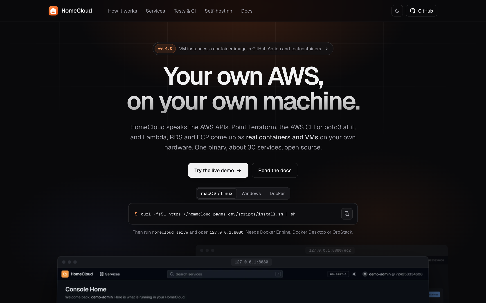
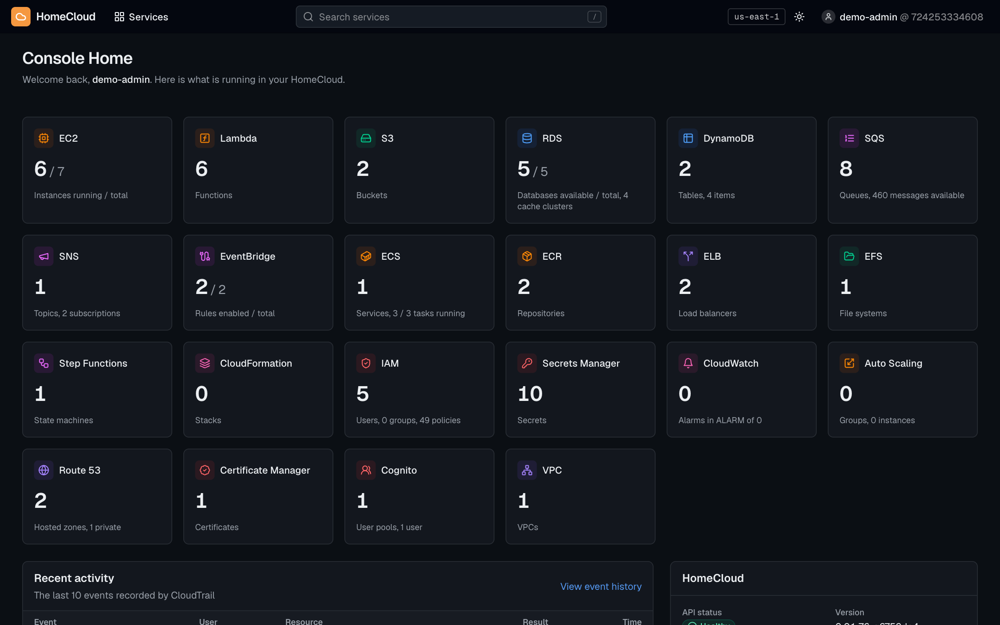
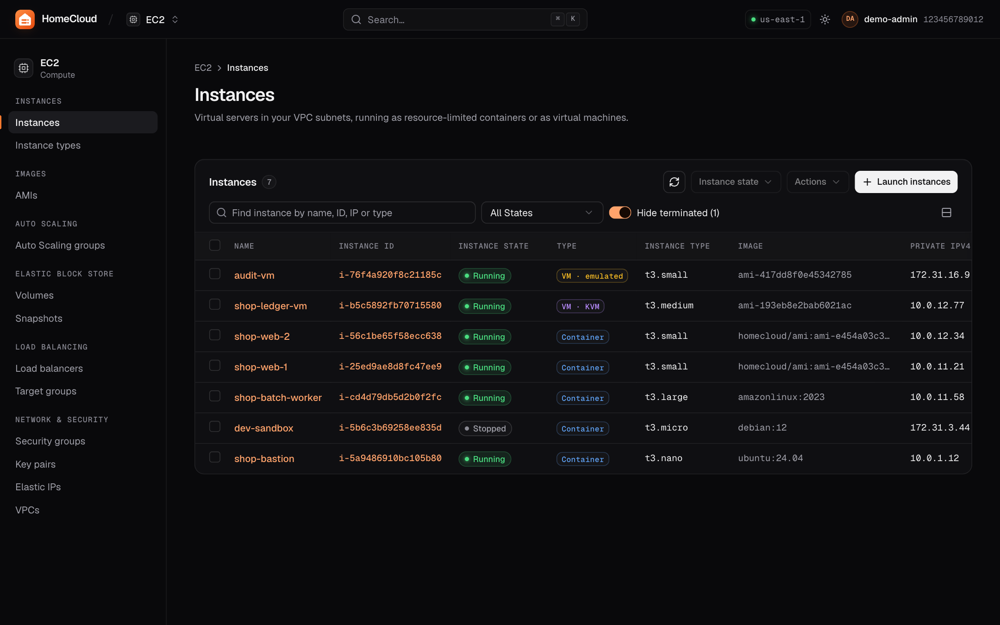
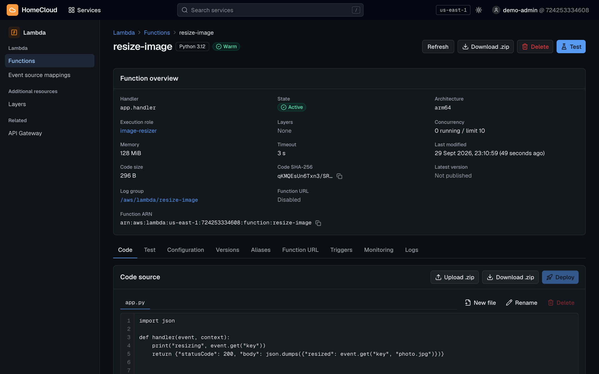
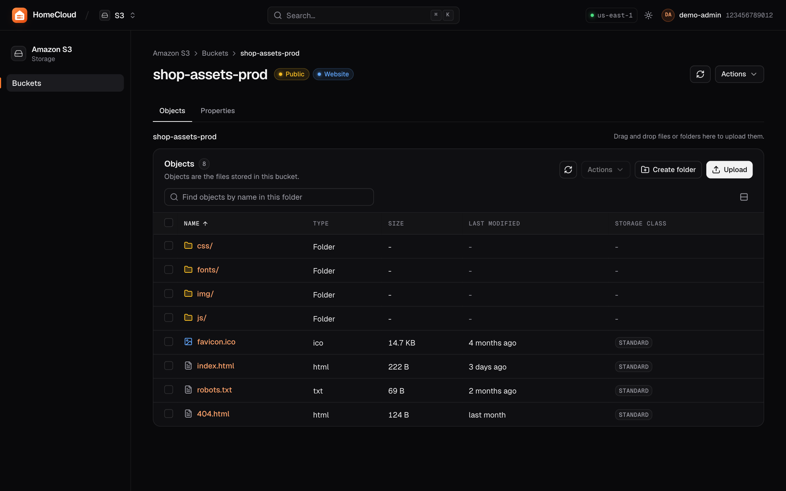
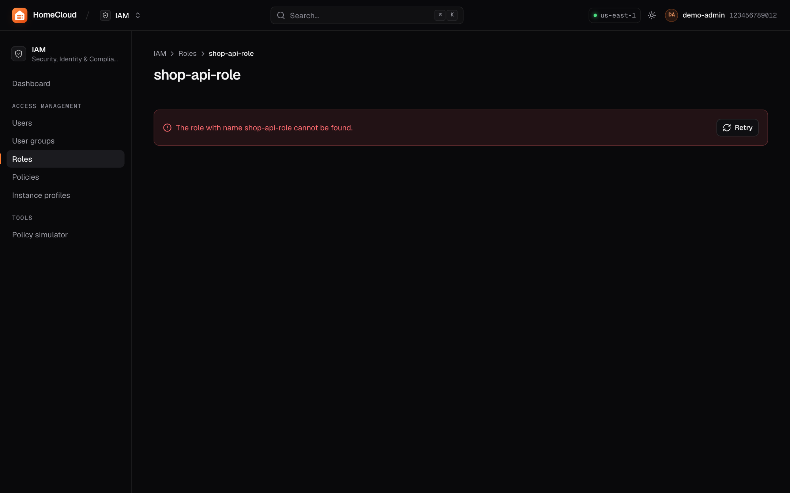
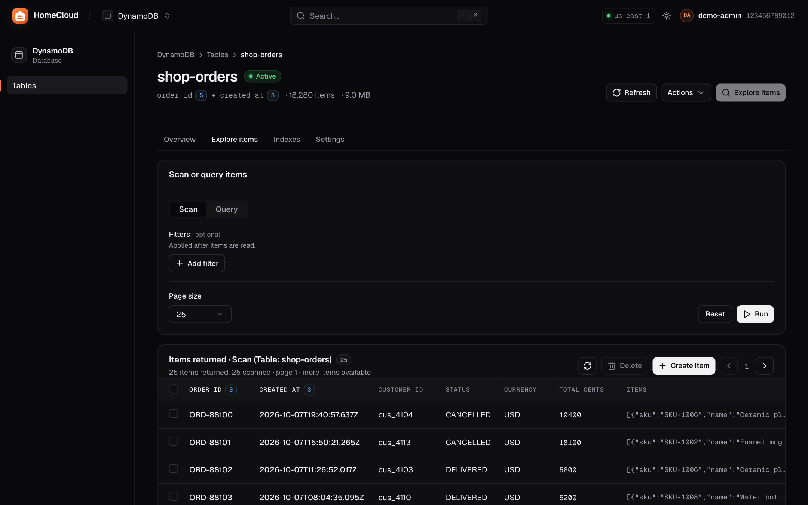
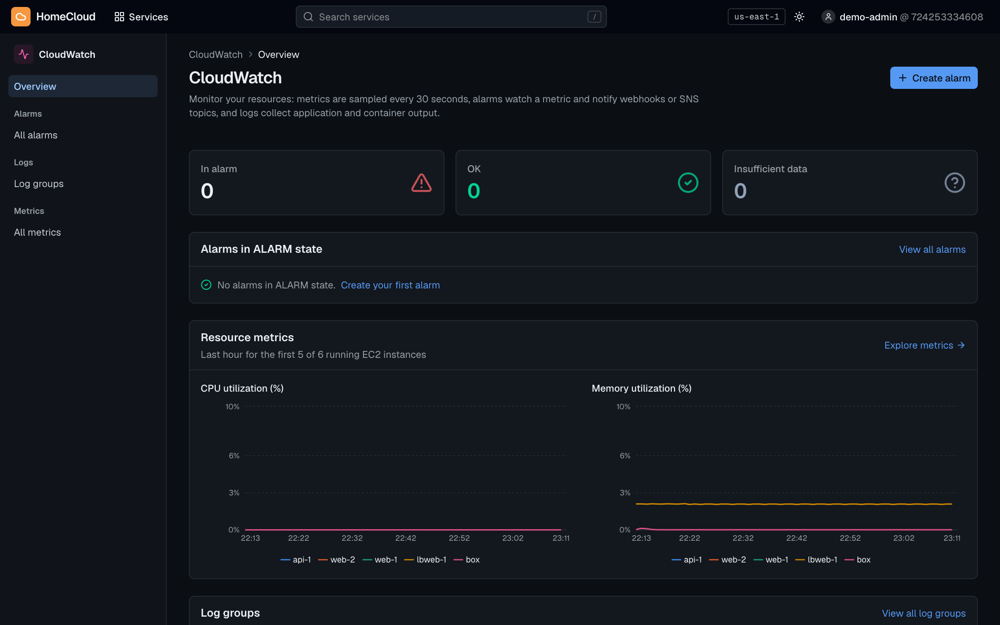

# ☁️ HomeCloud — The Cloud, Owned by You

<p align="center">
  <a href="https://homecloud.pages.dev"></a>
</p>

<p align="center">
  <a href="https://homecloud.pages.dev"><b>Website</b></a> ·
  <a href="https://homecloud.pages.dev/demo/"><b>Live demo</b></a> ·
  <a href="#-quick-start"><b>Quick start</b></a> ·
  <a href="docs/aws-compat.md"><b>AWS compatibility</b></a> ·
  <a href="docs/architecture.md"><b>Architecture</b></a> ·
  <a href="https://discord.gg/pemra9uaC9"><b>Discord</b></a>
</p>

**[Try the live demo console](https://homecloud.pages.dev/demo/)** — click through every service in your browser, no install needed (sample data, runs entirely client-side).

**An open-source, self-hosted cloud platform.** HomeCloud runs AWS-style services (compute, object storage, managed databases, serverless functions, queues, pub/sub, key-value tables, networking, identity, monitoring) on your own hardware, from one binary, managed through a web console, a CLI and a REST API.

**Speaks AWS.** The AWS CLI, the AWS SDKs and Terraform work against HomeCloud unchanged: point `AWS_ENDPOINT_URL` at it and use a HomeCloud access key. IAM policies, roles and temporary credentials are enforced exactly as in the console.

No third parties. No vendor lock-in. No surprise billing.

> 🛡 Built with privacy, transparency, and sovereignty at its core.

#### Support Partners

<p align="center" >
  <a href="https://tailscale.com/">
    
  </a>
</p>

<p align="center">
  <a href="https://coderabbit.ai/">
    
  </a>
</p>

---

## 🖥️ The console

A web console modeled on the one you know, with a page for every service. It is built into the binary: run `homecloud serve` and open http://127.0.0.1:8080.

<p align="center">
  
</p>

<table>
  <tr>
    <td width="50%"><p align="center"><b>EC2</b>: instances running as containers in your VPCs</p></td>
    <td width="50%"><p align="center"><b>Lambda</b>: functions with roles, versions, aliases and an in-browser editor</p></td>
  </tr>
  <tr>
    <td><p align="center"><b>S3</b>: buckets and objects, uploads, presigned links, websites</p></td>
    <td><p align="center"><b>IAM</b>: users, roles, AWS-managed and custom policies</p></td>
  </tr>
  <tr>
    <td><p align="center"><b>DynamoDB</b>: tables, queries and an item editor</p></td>
    <td><p align="center"><b>CloudWatch</b>: metrics for every resource, alarms and logs</p></td>
  </tr>
</table>

---

## 🧰 Services

| Service | AWS equivalent | What you get |
| --- | --- | --- |
| **Compute** | EC2, EBS, AMIs | Instances with CPU/memory limits from `t3.nano` to `r5.large`, 10 base images (Ubuntu, Debian, Amazon Linux, Rocky, Fedora, Alpine, …), user data, key pairs, start/stop/reboot/resize, volumes and snapshots, capture an instance as a new image, run-command, a shell in the browser, and an instance metadata service (IMDSv1/v2) that hands role credentials to SDKs inside instances |
| **Auto Scaling** | EC2 Auto Scaling | Groups that keep a desired number of instances across subnets, replace unhealthy ones, register them with load balancers and scale on CPU or memory targets |
| **Shared files** | EFS | File systems that any number of instances mount at the same time |
| **Containers** | ECS (Fargate), ECR | Versioned task definitions with secrets injected from Secrets Manager, services that keep N tasks running with rolling deployments and load-balancer registration, one-off tasks, and a private image registry you `docker push` to |
| **Networking** | VPC, ELB | VPCs and subnets with real private IP addressing, private DNS (`ip-10-88-0-4.internal`, `mydb.rds.internal`), security groups that filter traffic between resources (ingress and egress, by CIDR or by referenced group) and decide which ports are published; application load balancers with HTTP/HTTPS listeners, HTTP→HTTPS redirects, path/host routing rules, target groups and health checks |
| **DNS** | Route 53 | Public and private hosted zones (A, AAAA, CNAME, TXT, MX, SRV, CAA, NS, PTR), alias records that follow instances, tasks, databases and load balancers; a resolver at each VPC's `.2` address and a LAN-facing DNS port |
| **Certificates** | ACM | A private certificate authority that issues TLS certificates for your domains and IPs, import of Let's Encrypt or other certificates, renewal, and HTTPS on load balancers |
| **Object storage** | S3 | Buckets, folders, uploads/downloads, versioning, public-read access, lifecycle expiry, presigned URLs, static website hosting, and a fully S3-compatible endpoint for AWS SDKs and `aws` CLI |
| **Databases** | RDS, ElastiCache, DocumentDB | PostgreSQL, MySQL, MariaDB, MongoDB, Redis, Valkey, Memcached with generated credentials in Secrets Manager, snapshots and restore, daily automated backups, resizing, password rotation and a query editor |
| **Serverless** | Lambda, API Gateway | Functions on AWS's official runtime images (Python, Node.js, Java, Ruby, .NET, Go/Rust custom runtimes, container images) with warm environments, execution roles, versions and aliases, layers, async invocation with retries and destinations, reserved concurrency; function URLs; HTTP APIs with JWT authorizers; SQS and DynamoDB stream triggers |
| **Queues** | SQS | Standard and FIFO queues, visibility timeouts, delays, long polling, dead-letter queues with redrive, batches |
| **Pub/sub** | SNS | Standard and FIFO topics fanning out to queues, functions and confirmed HTTP(S) endpoints, signed messages, raw delivery, full filter-policy syntax |
| **Key-value** | DynamoDB | Typed items with the full condition/update/projection expression language, GSIs and LSIs, batches, transactions, PartiQL, TTL and streams |
| **Workflows** | Step Functions | State machines in Amazon States Language: Task (Lambda, SQS, SNS), Choice, Wait, Parallel, Map, Pass, Succeed, Fail, with Retry/Catch, JSONPath input/output processing, intrinsic functions and a full execution history |
| **Events** | EventBridge, Scheduler | Event buses with the full pattern syntax, input transformers, retries and DLQs; schedules with `at()`/`rate()`/`cron()` and time zones |
| **Identity** | IAM, STS | Users, groups, roles with trust policies, AWS-managed and custom policies (with versions, conditions and permissions boundaries), instance profiles, access keys, temporary credentials, console passwords, a policy simulator |
| **App identity** | Cognito | User pools with sign-up, sign-in, refresh tokens, forced password changes, groups and global sign-out; RS256 JWTs with a JWKS endpoint; API Gateway routes can require them |
| **Secrets & keys** | Secrets Manager, KMS, SSM Parameter Store | Versioned secrets with staging labels and Lambda rotation; symmetric, RSA, ECC and HMAC keys with policies, grants and rotation; hierarchical parameters with SecureString values, versions and labels |
| **Monitoring** | CloudWatch | Per-resource metrics, custom metrics with metric math, alarms that notify SNS topics or webhooks, log groups with filter patterns, Logs Insights queries and subscription filters |
| **Infrastructure as code** | CloudFormation | YAML/JSON stack templates for 30 resource types across every service, with parameters, outputs, `!Ref`/`!GetAtt`/`!Sub`/`!Join`, dependency ordering, readiness waits, rollback, updates and ordered deletion |
| **Audit** | CloudTrail | A record of every change and every denied request, with who, what, when and from where |

Everything runs as containers on Docker, labelled so HomeCloud never touches containers it didn't create. See **[docs/architecture.md](docs/architecture.md)** for how each service is built, **[docs/aws-compat.md](docs/aws-compat.md)** for the AWS APIs it speaks and **[docs/api.md](docs/api.md)** for the native API reference.

---

## 🚀 Quick start

You need **Docker** (Docker Engine on Linux, or Docker Desktop / OrbStack on macOS and Windows).

### Try it in one command

```bash
docker run -d --name homecloud -p 127.0.0.1:8080:8080 \
  -v /var/run/docker.sock:/var/run/docker.sock -v homecloud-data:/data \
  ghcr.io/solinode/homecloud
docker logs homecloud          # prints the root console password (once)
```

Open **http://127.0.0.1:8080** and sign in as `root`. Point the AWS CLI at it with
`eval "$(docker exec homecloud homecloud aws-env)"`, and use the bundled CLI with
`docker exec homecloud homecloud ...`. HomeCloud runs its services as containers on the same Docker
host, next to its own. Mounting the Docker socket gives the container control of that host, as the
binary has when you run it directly. Publish on `127.0.0.1` as above unless other machines need it; for
those, see [Docker](docs/install-server.md#docker) in the server guide (`--public-url`, TLS).

### Install

**Linux / macOS**

```bash
curl -fsSL https://homecloud.pages.dev/scripts/install.sh | sh
```

**Windows (PowerShell)**

```powershell
irm https://homecloud.pages.dev/scripts/install.ps1 | iex
```

Running it on a VPS or home server? See **[Install on a server](docs/install-server.md)** (system service, TLS, firewall, backups).

Or build from source with Go 1.25+ and Node.js 22+: `make` (the binary lands in `bin/homecloud`).

### Run

```bash
homecloud serve
```

On first start HomeCloud creates your account, prints the **root console password** once, and writes CLI credentials to `~/.homecloud/credentials`. Open **http://127.0.0.1:8080** and sign in as `root`.

To reach it from other machines, bind to your LAN or Tailscale address (add `--tls-self-signed`, or `--tls-cert`/`--tls-key`, to serve HTTPS):

```bash
homecloud serve --addr 0.0.0.0:8080 --public-host homelab.tailnet.ts.net --tls-self-signed
```

### Use it from the CLI

```bash
# Compute: a web server whose port 80 is published
homecloud vpc create-sg web && homecloud vpc allow sg-xxxx 80
homecloud ec2 run --name web --image ami-nginx --sg sg-xxxx
homecloud ec2 ssh i-xxxx

# Storage
homecloud s3 mb s3://photos
homecloud s3 cp ./beach.jpg s3://photos/2025/
homecloud s3 presign s3://photos/2025/beach.jpg

# A PostgreSQL database; the password lives in Secrets Manager
homecloud rds create orders-db --engine postgres --public
homecloud rds query orders-db "select version()"
homecloud rds password orders-db

# Serverless: a function behind an HTTP API, fed by a queue
homecloud lambda create resize --runtime python3.12 --code ./resize
homecloud lambda url resize
homecloud sqs create jobs --dlq jobs-dlq
homecloud lambda trigger resize jobs

# Schedules and events
homecloud events schedule nightly 'cron(0 3 ? * * *)' --target arn:aws:lambda:us-east-1:<account>:function:resize

# Containers behind a load balancer
docker tag myapi localhost:5500/myapi:1 && docker push localhost:5500/myapi:1
homecloud elb create-target-group api-tg --port 8000
homecloud elb create web --listen 80=api-tg
homecloud ecs register api --image localhost:5500/myapi:1 --port 8000 --secret DB_PASS=prod/db:password
homecloud ecs create-service api api --count 3 --target-group api-tg

# Infrastructure as code (see docs/examples/pipeline.yaml)
homecloud cfn create pipeline docs/examples/pipeline.yaml -p Env=dev
homecloud cfn delete pipeline

# Anything else
homecloud api GET /api/v1/cloudwatch/alarms
```

Run `homecloud --help` or `homecloud <service> --help` for every command.

### Use it from AWS tools

HomeCloud speaks the AWS protocols on its API port, so the AWS CLI, SDKs (boto3, JS, Go, Java) and Terraform work unchanged with HomeCloud credentials and IAM:

```bash
eval "$(homecloud aws-env)"       # AWS_ENDPOINT_URL, keys and region
aws s3 ls
aws lambda invoke --function-name hello out.json
```

See [docs/aws-compat.md](docs/aws-compat.md) for the supported services and operations.

### Run it as a service, back it up, upgrade it

```bash
homecloud service install         # launchd (macOS) or systemd (Linux)
homecloud backup -o backup.tar.gz # state, keys and every Docker volume
homecloud restore backup.tar.gz   # with the server stopped
homecloud upgrade                 # verified update from GitHub releases
```

---

## 🗺️ Roadmap

* ✅ **Phase 1:** Core cloud stack: compute, storage, networking, web console, CLI and API
* ✅ **Phase 2:** Serverless and event-driven services: Lambda, API Gateway, SQS, SNS, EventBridge, DynamoDB
* ✅ **Phase 3 (first cut):** Observability and governance: CloudWatch metrics/logs/alarms, CloudTrail, IAM, Secrets Manager
* ✅ **Containers:** ECS services and tasks, ECR registry, load balancers, shared file systems
* ✅ **Workflows:** Step Functions
* ✅ **Infrastructure as code:** CloudFormation-style stacks
* ✅ **AWS compatibility:** the AWS CLI, SDKs and Terraform work against HomeCloud for IAM/STS, EC2/VPC, S3, Lambda, DynamoDB, SQS, SNS, Secrets Manager, SSM, KMS, CloudWatch, EventBridge, Step Functions, Elastic Load Balancing, Auto Scaling, ECS and ECR
* 🔄 **Next:** AWS APIs for RDS, API Gateway, Route 53, ACM, EFS, ElastiCache and CloudFormation; stricter security groups and resource policies; VM-backed instances (QEMU/KVM); multi-node clusters
* 🔄 **Phase 4:** Edge compute and hardware integrations

Designs for the two largest open items: **[multi-node clusters](docs/design/multi-node.md)** ([#55](https://github.com/solinode/homecloud/issues/55)) and **[edge compute and hardware integrations](docs/design/edge.md)** ([#56](https://github.com/solinode/homecloud/issues/56)).

📍 **[See the open issues](https://github.com/solinode/homecloud/issues)** for everything planned, with a checklist per item.

---

## 🧑‍💻 Development

```
cli/        Go server + CLI (single binary)
  cmd/                 CLI commands
  internal/server      wires services into one HTTP API
  internal/svc/<name>  one package per service (ec2, s3, rds, lambda, ...)
  internal/httpx       native API routing, IAM checks, errors
  internal/awsapi      AWS protocols: SigV4, awsJson, awsQuery, REST
  internal/system      backup and restore
  internal/runtime     Docker engine wrapper
  internal/store       persistent state
console/    Next.js web console (static export, embedded into the binary)
docs/       architecture and API reference
```

```bash
make test                          # Go tests (AWS CLI/boto3 tests run when installed)
cd cli && go run . serve           # API on :8080
cd console && NEXT_PUBLIC_API_URL=http://127.0.0.1:8080 npm run dev   # console on :3000
make release                       # cross-compiled archives for 6 platforms in dist/
```

Releases are built by GitHub Actions when a `v*` tag is pushed.

---

## 💸 Sustainability & Support

HomeCloud is a community project, currently unfunded and maintained by volunteers.

### 💛 Ways to Support

* [ ] Sponsor development via GitHub Sponsors / Open Collective (Coming Soon)
* [ ] Contribute infrastructure, bugfixes, or UX improvements
* [ ] Share HomeCloud with your communities!

---

## 🤝 Get Involved

We’re building HomeCloud for the community, and we’d love for you to join us:

💬 **[Join the Discord Community](https://discord.gg/pemra9uaC9)**: connect, discuss, and collaborate.
🛠️ **Contribute Code**: check out **Issues** and **Pull Requests** to get started.
📣 **Share Feedback**: help shape what HomeCloud becomes.

🔹 **By contributing, you agree to our** [**Contributor License Agreement (CLA)**](./CLA.md).

---

## 🛡 License

HomeCloud is released under **GNU AGPL-3.0**: open, transparent, and libre.
If you deploy or modify it publicly, share your changes too.

---

## ⚡ HomeCloud: The Cloud, On Your Terms.
